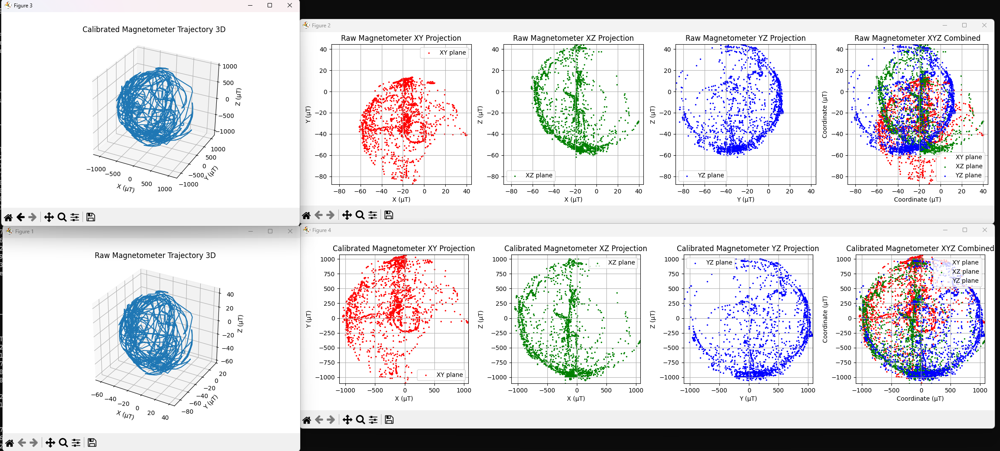

# Magnetometer calibration

Ellipsoid fitting using python numpy to calibrate magnetometers:

This tool performs magnetometer calibration using ellipsoid fitting to correct for
hard iron and soft iron distortions. It can read data from CSV or TXT files,
perform calibration, apply existing calibrations, and visualize results.

# Usage :
1) output you raw data from sensor and name it `mag_out.txt` in format x,y,z (uT) or in a csv file

2) optionally set the MField Value:
get the Total Field for your location from here:
http://www.ngdc.noaa.gov/geomag-web (tab Magnetic Field)
 es. Total Field = 47,241.3 nT | my val :47'789.7

and use `--field` flag

3) run script
Defaults to `python calibrate.py` with mag_out.txt

Example Usage:
    `python calibrate.py -f magnetometer_data.csv --plot`
    `python calibrate.py -f mag_out.txt --json --save`
    `python calibrate.py -f data.csv --apply already_calibrated_matrix.json --plot`

4) get "Hard Iron Bias" and "Soft Iron bias" matrixes (and c++ according code)

       // Taken from calibrate.py or magcal
        float hard_iron_bias_x =  41.45884154873271 ;
        float hard_iron_bias_y =  -87.79628696573607 ;
        float hard_iron_bias_z =  569.4171225039286 ;

        double soft_iron_bias_xx =  0.5823136909144911 ;
        double soft_iron_bias_xy =  0.007124620314368133 ;
        double soft_iron_bias_xz =  -0.024442807568982334 ;

        double soft_iron_bias_yx =  0.00712462031436818 ;
        double soft_iron_bias_yy =  0.5906868599676302 ;
        double soft_iron_bias_yz =  0.005356720947343228 ;

        double soft_iron_bias_zx =  -0.024442807568982372 ;
        double soft_iron_bias_zy =  0.005356720947343263 ;
        double soft_iron_bias_zz =  0.7210550285247264 ;
        
        // get values x,y,z and subtract the hard iron offset
        float xm_off = id(hmc5883l_x).state - hard_iron_bias_x;
        float ym_off = id(hmc5883l_y).state - hard_iron_bias_y;
        float zm_off = id(hmc5883l_z).state - hard_iron_bias_z;
        
        // multiply by the inverse soft iron offset 
        float xm_cal = xm_off *  soft_iron_bias_xx + ym_off *  soft_iron_bias_yx  + zm_off *  soft_iron_bias_zx;
        float ym_cal = xm_off *  soft_iron_bias_xy + ym_off *  soft_iron_bias_yy + zm_off *  soft_iron_bias_zy;
        //not needed : float zm_cal = xm_off *  soft_iron_bias_xz + ym_off *  soft_iron_bias_yz  + zm_off *  soft_iron_bias_zz;
        
        //float heading = atan2(ym_cal, xm_cal);
        float heading = atan2(0 - xm_cal, ym_cal);
        
        //heading += id(magnetic_declination); 
        
        if(id(enable_magnetometer_serial_output) == true){
        ESP_LOGD("main", "%.1f,%.1f,%.1f", id(hmc5883l_x).state, id(hmc5883l_y).state, id(hmc5883l_z).state);
        }
        // Correct for when signs are reversed.
        if (heading < 0) {
        heading += 2*PI;
        }
        // Check for wrap due to addition of declination.
        if (heading > 2*PI) {
        //heading -= 2*PI;
        }
        float headingDegrees = heading * 180/M_PI; // Convert radians to degrees.
        return headingDegrees;

---
If you run [esphome](https://esphome.io), a [sample code is included](https://github.com/nliaudat/magnetometer_calibration/blob/main/esphome_code.yaml) to output raw data and get corrected values.

# Working demo

If you want a sample or a working demo, look at https://github.com/nliaudat/weatherstation

# Requirements : 
calibrate.py requires numpy,scipy, pandas and optional matplotlib to plot the graph
     
# Thanks : 
[John zhang12300](https://github.com/zhang12300) for issuing the bug

[jremington](https://github.com/jremington) for fixing the bug

## Sources :
        -  https://teslabs.com/articles/magnetometer-calibration/      
        -  https://www.best-microcontroller-projects.com/hmc5883l.html

